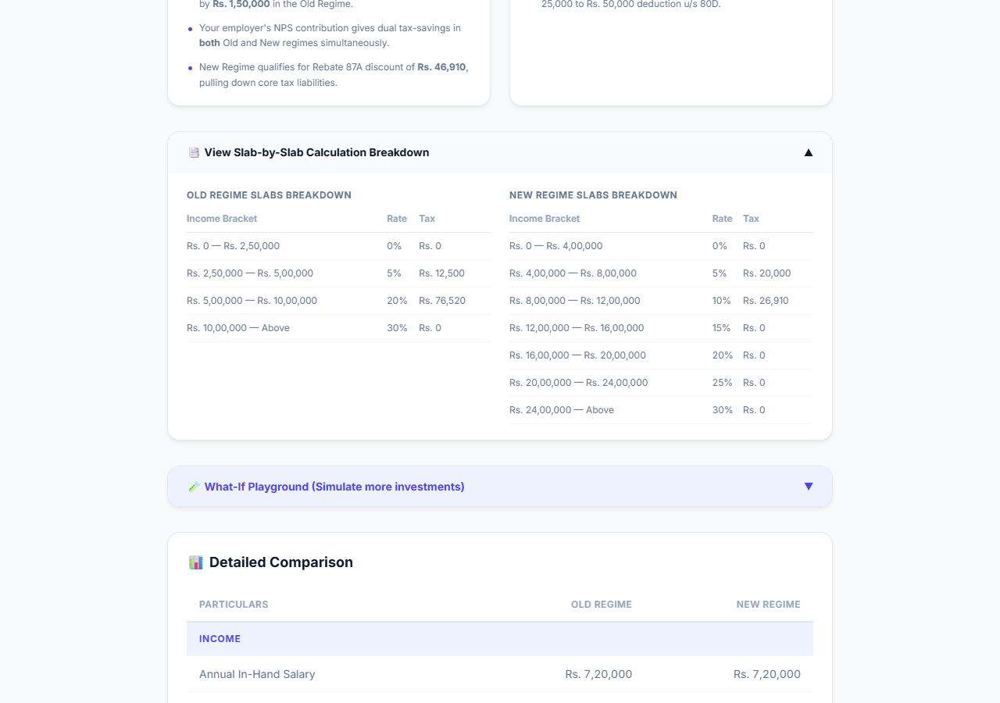
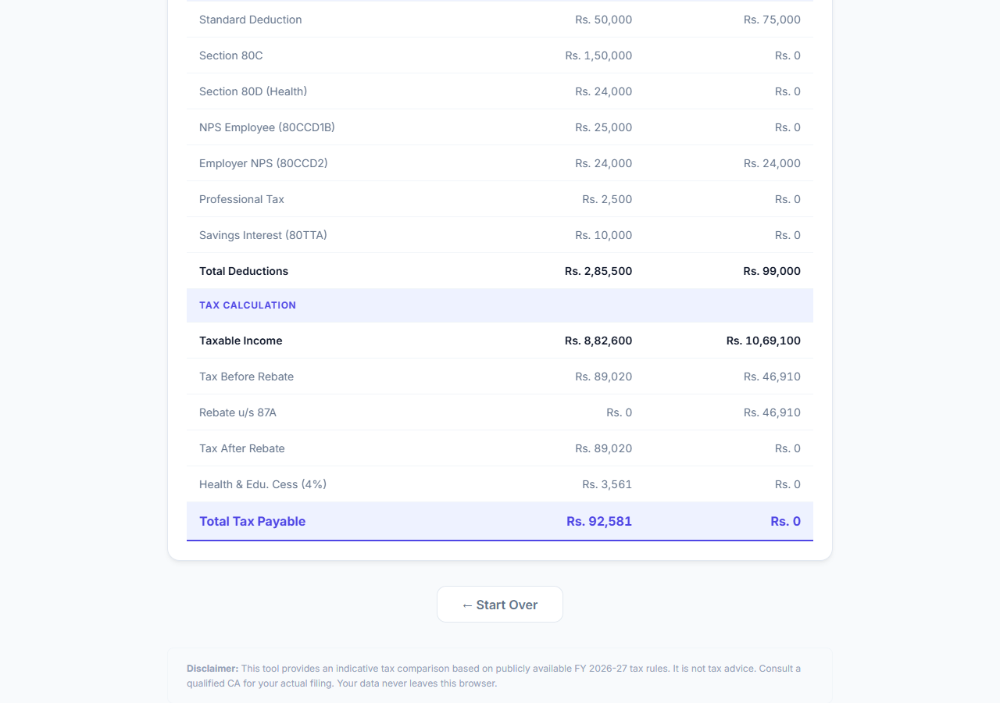

<p align="center">
  
</p>

<h2 align="center">🇮🇳 Lekha Tax Calculator (FY 2026-27)</h2>
<p align="center"><b>A privacy-focused, browser-based wizard for comparing Old vs. New Tax Regimes in India.</b></p>

<p align="center">
  <!-- Core Stack -->
  <a href="https://react.dev/">
    
  </a>
  <a href="https://vitejs.dev/">
    
  </a>
  <a href="https://www.typescriptlang.org/">
    
  </a>
  <a href="https://developer.mozilla.org/en-US/docs/Web/CSS">
    
  </a>
</p>

<p align="center">
  <!-- Architecture Badges -->
  
  
  
  
</p>

<p align="center">
  <b>Framework:</b> React &nbsp; | &nbsp;
  <b>Bundler:</b> Vite &nbsp; | &nbsp;
  <b>Language:</b> TypeScript
</p>

<p align="center">
  Lekha Tax Calculator empowers salaried individuals to make highly informed financial decisions through a gorgeous 8-step wizard. It instantly calculates, compares, and recommends the optimal tax regime without ever sending your sensitive financial data to a server.
</p>

---

A beautiful, lightning-fast React application that navigates the complexity of Indian tax codes—translating dense calculations into actionable, plain-English insights, what-if simulations, and relatable lifestyle metrics.

---

## 📖 Description

### 🔹 What it does  
It walks users through an intuitive 8-step wizard collecting salary, rent, investments, and deductions. Behind the scenes, a pure mathematics engine strictly computes taxes based on FY 2026-27 rules (including marginal relief and Rebate 87A) for both Old and New regimes, presenting a definitive recommendation.

### 🔹 What problem it solves  
Choosing between the Old and New tax regimes is an opaque, confusing process. This tool eliminates spreadsheets and expensive consultations, offering immediate clarity, educational breakdowns, and complete data privacy.

### 🔹 Motivation  
Inspired by the annual struggle of salaried professionals trying to decipher government tax notifications, this project aims to bring consumer-grade design, absolute transparency, and a touch of delight to personal finance. While Chartered Accountants would continue to prefer using enterprise-grade SaaS applications such as Winman CA-ERP or Relyon, this tool is for the masses and aims to make tax planning accessible to everyone. 

---

## 🎥 Demo Video

[](https://youtu.be/OoaxD3bWJC0)

 

---

## 📸 Screenshots

<p align="center">
  
  <br><i>The dynamic Results Page highlighting the winning regime and real-world savings.</i>
</p>

<p align="center">
  
  <br><i>Comprehensive line-by-line comparison of gross income, deductions, and tax computations.</i>
</p>

<p align="center">
  
  <br><i>Interactive What-If Simulation Playground to tweak your salary and investments.</i>
</p>

<p align="center">
  
  <br><i>Tangible Lifestyle Equivalents turning tax savings into relatable metrics.</i>
</p>

---

## ✨ Notable Features & Enhancements

We've gone far beyond a basic calculator to deliver an exceptional user experience:

- **🧪 What-If Playground:** Instantly simulate how "extra 80C investments," "extra NPS," or a "hypothetical salary hike" would shift the winning regime recommendation without reloading or losing state.
- **🎓 Explain Like I'm 21 (ELI21) Mode:** A global toggle switch that instantly translates complex tax jargon (like *Section 80CCD1B* or *Rebate u/s 87A*) into simple, plain English across the entire interface.
- **🍿 Lifestyle Equivalent Metrics:** Transforms abstract tax savings into tangible metrics—showing you exactly how many months of premium OTT streaming or gourmet coffees your tax savings equate to.
- **📑 Slab-by-Slab Breakdown:** An expandable accordion providing absolute mathematical transparency, showing exactly how your income is sliced and taxed across different percentage brackets.
- **💡 Actionable Advisory Hints:** Dynamic bullet points that analyze your inputs to suggest unused tax-saving headroom (e.g., maximizing the remaining balance of the ₹1.5L 80C bucket).
- **🎉 Delightful Micro-interactions:** CSS-only falling confetti overlays upon reaching the results page, paired with a seamless one-click "Share Result" clipboard feature.

---

## 📂 Folder Structure

```bash
TaxAppNewRules/
├─ src/
│  ├─ components/
│  │  ├─ steps/              # Individual wizard steps (Step1Salary -> Step8OtherIncome)
│  │  ├─ LivePreview.tsx     # Persistent side-panel showing real-time impact
│  │  ├─ Results.tsx         # Comprehensive dashboard (Playground, Breakdowns, ELI21)
│  │  ├─ Wizard.tsx          # Step orchestration and navigation logic
│  │  └─ FAQ.tsx             # Contextual help module
│  │
│  ├─ context/
│  │  └─ TaxContext.tsx      # Global state management (useReducer pattern)
│  │
│  ├─ utils/
│  │  ├─ formatCurrency.ts   # Indian numbering system formatter
│  │  ├─ taxCalc.ts          # Shared deduction constraint logic (HRA, 80C, etc.)
│  │  └─ taxEngine.ts        # Pure math engine (Slabs, Age, Marginal Relief, Cess)
│  │
│  ├─ App.tsx                # App routing (Landing -> Wizard -> Results)
│  └─ index.css              # Global design tokens and root styles
│
├─ artifacts/                # Screenshots and documentation assets
├─ package.json              # Project dependencies and npm scripts
└─ vite.config.ts            # Vite bundler configuration
```

---

## ⚙️ Installation Steps

```bash
# 1) Clone the repository
git clone https://github.com/yourusername/TaxRegimeCalculator.git
cd TaxRegimeCalculator

# 2) Install dependencies
npm install

# 3) Start the development server
npm run dev

# 4) Verify successful launch
# Open http://localhost:5173/ in your browser
```

---

## ▶️ Execution & Usage

### Running Locally

```bash
# From the project root
npm run dev
```

**In the app:**  
- Click **"Start Calculation"** from the landing page.
- Navigate through the 8-step wizard, inputting your salary, bonuses, rent, and investments. Watch the **Live Preview** panel update your potential tax liability in real-time.
- On Step 8, click **"See Results"** to navigate to the comprehensive dashboard.
- Toggle **Explain Like I'm 21**, experiment with the **What-If Playground**, and view the detailed slab breakdown.

✅ **Privacy Guarantee:**  
- The application is 100% client-side. No data is ever persisted to a backend database or sent over a network payload. Everything happens in your browser's memory.

---

## 🛠️ Technologies Used

- ✅ **React 19** (Component Architecture & Context API)
- ✅ **TypeScript 6** (Strict Typings for complex tax structures)
- ✅ **Vite 8** (Ultra-fast HMR and building)
- ✅ **Vanilla CSS Modules** (Custom design tokens, gradients, animations)
- ✅ **ESLint** (Strict code quality enforcement)

---

## 🚀 Roadmap & Future Updates

- 💾 **Local Storage Persistence**: Allow users to save their sessions securely in `localStorage` to resume calculations later.
- 📉 **Visual Charts**: Integrate Recharts or Chart.js for beautiful pie-charts representing income vs. tax ratios.
- 📱 **PWA Support**: Turn the calculator into a Progressive Web App for offline usage on mobile devices.
- 🖨️ **PDF Export**: Generate a beautifully formatted PDF report of the detailed tax comparison for tax filing reference.

---

## 🙏 Credits and Acknowledgements

- Built specifically focusing on the new Indian Income Tax slabs for FY 2026-27.
- Open-source maintainers across the React, Vite, and TypeScript ecosystems.

---

## ⚠️ Disclaimer

**"This tool provides an indicative tax comparison based on publicly available FY 2026-27 tax rules. It is not tax advice. Consult a qualified Chartered Accountant (CA) for your actual filing."**

---

## 📌 Quick Tips

- **Use the What-If Sliders:** The easiest way to decide whether to make that last-minute tax-saving investment is to use the Playground sliders on the Results page.
- **HRA vs. New Regime:** Remember, you cannot claim HRA (House Rent Allowance) in the New Regime. The app calculates this automatically, but you can visually see the impact in the Live Preview panel on Step 4!
---

*Empowering your personal finance through absolute transparency.*
